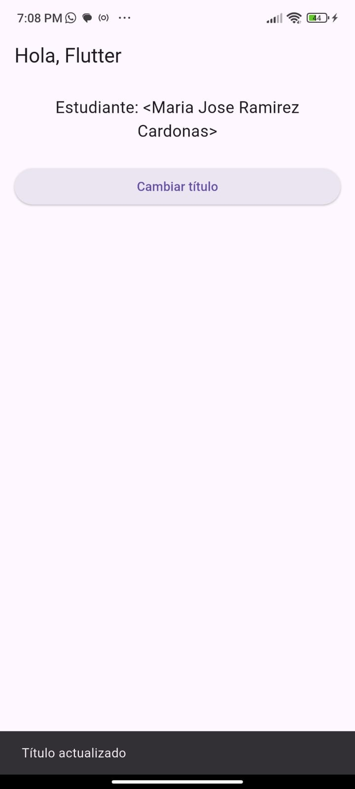
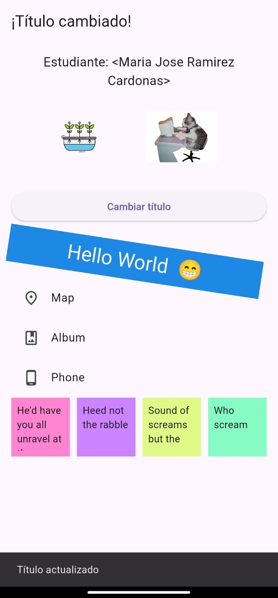
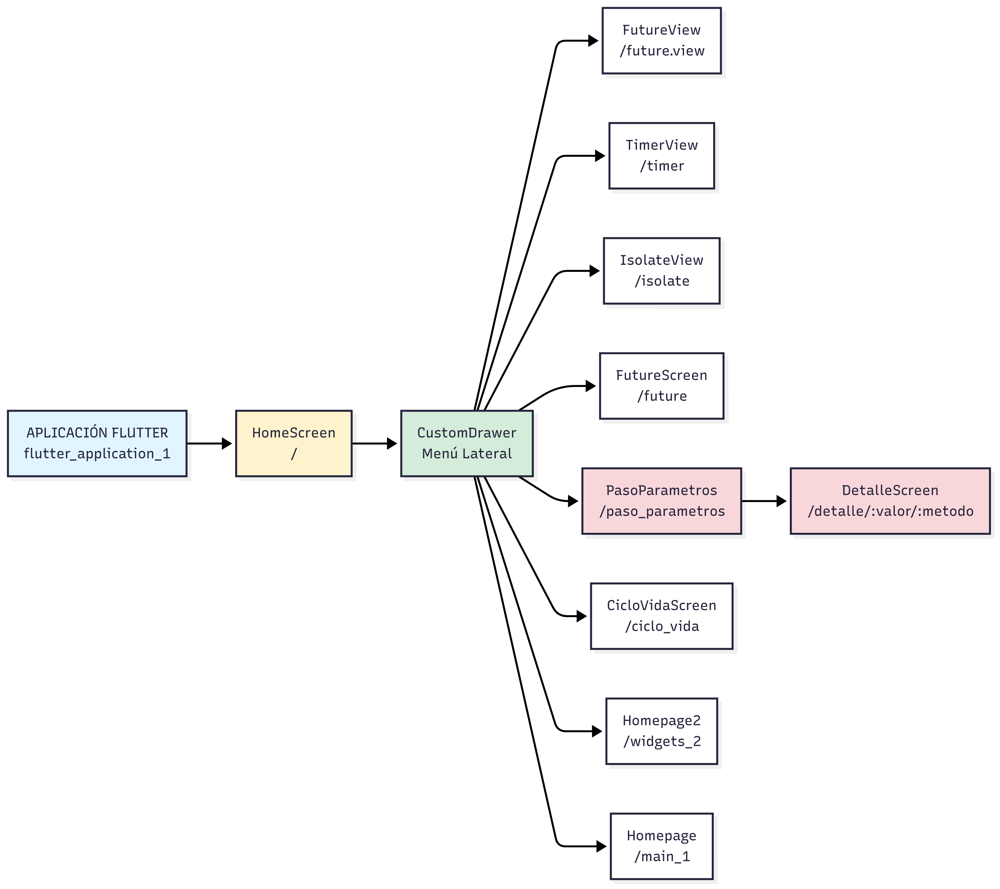

# 📱Talleres Segundo Corte - Moviles

El Proyecto encontraras prácticas para aprender los conceptos fundamentales de Flutter y el manejo basico de widgets.

## 👩‍💻😺 Datos del estudiante
### **Nombre:** Maria Jose Ramirez Cardona
### **Código:** 230212022

---

## 📗 Descripción breve

Este taller muestra una pantalla principal con:
- AppBar dinámico que cambia su título.
- Nombre del estudiante.
- Imágenes locales y de red.
- Botón que actualiza el título y muestra un SnackBar.
- Ejemplo de Container, ListView y GridView.
- Diseño organizado con Column, Padding y SizedBox.

---

## Pasos para ejecutar

1. **Clona o descarga el proyecto.**
2. **Instala las dependencias:**
   ```sh
   flutter pub get
   ```
3. **Ejecuta la app:**
   ```sh
   flutter run
   ```
4. **Asegúrate de tener el archivo de imagen local** en `assets/images/hidroponia.png` y que esté registrado en tu `pubspec.yaml`.


---

## 📸 Capturas de pantalla

### Pantalla Inicial


### Cambio de Título


### Pantalla Final



# ❓Cuándo usar:

## - Future
Representa operaciones que se completan en el futuro. Perfecto para modelar tareas como llamadas a API o consultas a base de datos.
## - async/await
Una forma más legible de trabajar con código asincrónico, usando un estilo secuencial sin bloquear la UI.

## - Isolate 
Hilos de ejecución paralelos con memoria independiente, ideales para tareas pesadas que de otro modo congelarían la aplicación.

Incluir diagrama/lista de pantallas y flujos (cronómetro y proceso pesado).

# 🪟 Lista de Vistas
- 🏠Home
- 📘Taller 1
- 📗Taller 2
- 🔄️Ciclo de Vida
- ⚙️Paso Parametros
- 📂Future
- 🧵Isolate
- ⏱️Cronometro

### Diagrama Vistas

